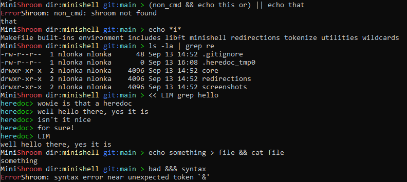

<a id="readme-top"></a>

<div align="center">
  <h2 align="center">Minishell</h3>
</div>

<details>
  <summary>Table of Contents</summary>
  <ol>
    <li>
      <a href="#about-the-project">About the project</a>
      <ul>
        <li><a href="#features-implemented">Features implemented</a></li>
      </ul>
    </li>
    <li>
      <a href="#getting-started">Getting started</a>
      <ul>
        <li><a href="#prerequisites">Prerequisites</a></li>
        <li><a href="#how-to-run-it">How to run it</a></li>
      </ul>
    </li>
    <!--<li><a href="#usage">Usage</a></li>-->
    <!--<li><a href="#roadmap">Roadmap</a></li>-->
  </ol>
</details>


<!-- ABOUT THE PROJECT -->
## About the project

This is a shell with functionality largely inspired by bash

### Features implemented
- **Command execution**: executes binaries placed in directories indicated by the PATH enviroment variable
- **Pipes**: chains together the inputs and outputs of piped commands
- **Redirections**: you can use files as input or write a commands output to a file
- **Builtins**: echo, cd, pwd, export, unset, env and exit as rewritten builtins
- **Environment variables**: keeps track of existing, added and removed environment variables
- **Wildcards**: the wildcard * is usable in the current working directory
- **Logical operators**: supports using &&, || and parentheses for chaining commands together based on the return values
- **Parsing**: extensive parsing based on an abstract syntax tree (AST), closely replicating the error handling of bash
- **Fancy prompt**: for your convenience the prompt shows the current directory and git repo




<!-- GETTING STARTED -->
## Getting started

This is how you might run this program locally.
Do note that it was originally made for a unix system, so your mileage may vary depending on your machine. 

### Prerequisites

As this program is coded in C, you will need a compiler like gcc

### How to run it

```
git clone https://github.com/Rubidium7/minishell.git
cd minishell
make && ./minishell  
```


<!-- USAGE EXAMPLES
## Usage

Use this space to show useful examples of how a project can be used. Additional screenshots, code examples and demos work well in this space. You may also link to more resources.

 -->


<!-- ROADMAP -->
<!--## Roadmap

- [ ] Feature 1
- [ ] Feature 2
- [ ] Feature 3
    - [ ] Nested Feature -->


<p align="right">(<a href="#readme-top">back to top</a>)</p>
